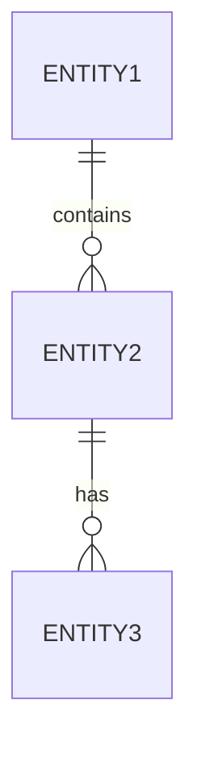

# 设计文档 (DESIGN.md)

> 扩展结构设计文档模板

---

## 1. 背景与目标

### 1.1 项目背景

> 描述项目的业务背景和解决的问题

待填充

### 1.2 业务目标

> 描述项目的业务目标和成功指标

| 目标 | 指标 | 目标值 |
|------|------|--------|
| 目标1 | 待定义 | 待定义 |

### 1.3 技术目标

> 描述项目的技术目标和约束

| 目标 | 说明 |
|------|------|
| 性能目标 | 待填充 |
| 可扩展性 | 待填充 |
| 可维护性 | 待填充 |

---

## 2. 架构设计

### 2.1 整体架构

> 描述系统的整体架构

```
┌─────────────────────────────────────────────────────────┐
│                      用户界面层                          │
├─────────────────────────────────────────────────────────┤
│                      业务逻辑层                          │
├─────────────────────────────────────────────────────────┤
│                      数据访问层                          │
├─────────────────────────────────────────────────────────┤
│                      数据存储层                          │
└─────────────────────────────────────────────────────────┘
```

### 2.2 模块划分

| 模块名称 | 职责 | 依赖模块 |
|----------|------|----------|
| 待定义 | - | - |

### 2.3 技术选型

| 层级 | 技术选择 | 选择理由 |
|------|----------|----------|
| 前端 | 待填充 | - |
| 后端 | 待填充 | - |
| 数据库 | 待填充 | - |
| 缓存 | 待填充 | - |
| 部署 | 待填充 | - |

---

## 3. 数据模型

### 3.1 实体关系

> 描述核心实体及其关系



### 3.2 数据字典

| 实体名称 | 字段列表 | 说明 |
|----------|----------|------|
| 待定义 | - | - |

### 3.3 存储方案

| 数据类型 | 存储方式 | 说明 |
|----------|----------|------|
| 结构化数据 | 待填充 | - |
| 非结构化数据 | 待填充 | - |
| 缓存数据 | 待填充 | - |

---

## 4. API设计

### 4.1 接口规范

**基础URL**: `/api/v1`

**请求格式**: `application/json`

**响应格式**:
```json
{
  "code": 0,
  "data": {},
  "message": "success",
  "timestamp": "2026-03-22T10:00:00Z"
}
```

### 4.2 接口列表

| 接口名称 | 方法 | 路径 | 说明 |
|----------|------|------|------|
| 待定义 | - | - | - |

### 4.3 错误码定义

| 错误码 | 说明 | 处理建议 |
|--------|------|----------|
| 0 | 成功 | - |
| 400 | 请求参数错误 | 检查请求参数 |
| 401 | 未授权 | 检查认证信息 |
| 403 | 禁止访问 | 检查权限 |
| 404 | 资源不存在 | 检查资源路径 |
| 500 | 服务器内部错误 | 联系管理员 |

---

## 5. 技术选型

### 5.1 前端技术栈

| 技术 | 版本 | 用途 |
|------|------|------|
| 待填充 | - | - |

### 5.2 后端技术栈

| 技术 | 版本 | 用途 |
|------|------|------|
| 待填充 | - | - |

### 5.3 基础设施

| 组件 | 选择 | 说明 |
|------|------|------|
| 服务器 | 待填充 | - |
| 数据库 | 待填充 | - |
| 缓存 | 待填充 | - |
| 消息队列 | 待填充 | - |
| 监控 | 待填充 | - |

---

## 6. 性能方案

### 6.1 性能目标

| 指标 | 目标值 | 说明 |
|------|--------|------|
| 响应时间 | < 200ms | P99 |
| 吞吐量 | 待定义 | QPS |
| 可用性 | 99.9% | 年度 |

### 6.2 优化策略

| 策略 | 说明 | 适用场景 |
|------|------|----------|
| 缓存 | 待填充 | - |
| 异步处理 | 待填充 | - |
| 分库分表 | 待填充 | - |

### 6.3 监控方案

| 监控类型 | 工具 | 指标 |
|----------|------|------|
| 应用监控 | 待填充 | - |
| 基础设施监控 | 待填充 | - |
| 业务监控 | 待填充 | - |

---

## 7. 安全方案

### 7.1 安全威胁分析

| 威胁类型 | 风险等级 | 说明 |
|----------|----------|------|
| SQL注入 | 高 | 待评估 |
| XSS攻击 | 中 | 待评估 |
| CSRF攻击 | 中 | 待评估 |
| 数据泄露 | 高 | 待评估 |

### 7.2 安全措施

| 措施 | 说明 | 状态 |
|------|------|------|
| 身份认证 | 待填充 | 计划中 |
| 权限控制 | 待填充 | 计划中 |
| 数据加密 | 待填充 | 计划中 |
| 日志审计 | 待填充 | 计划中 |

### 7.3 合规要求

- [ ] 数据安全法
- [ ] 个人信息保护法
- [ ] 行业规范（如有）

---

## 8. 风险分析

### 8.1 技术风险

| 风险 | 可能性 | 影响 | 应对措施 |
|------|--------|------|----------|
| 待识别 | - | - | - |

### 8.2 业务风险

| 风险 | 可能性 | 影响 | 应对措施 |
|------|--------|------|----------|
| 待识别 | - | - | - |

### 8.3 应对预案

| 预案名称 | 触发条件 | 处理步骤 |
|----------|----------|----------|
| 待定义 | - | - |

---

## 9. 附录

### 9.1 术语表

| 术语 | 定义 |
|------|------|
| 待定义 | - |

### 9.2 参考文档

- [AGENTS.md](../AGENTS.md) - 开发规范
- [MEMORY.md](./MEMORY.md) - 项目记忆
- [TASKS.md](./TASKS.md) - 任务管理

---

*最后更新: 2026-03-22*
