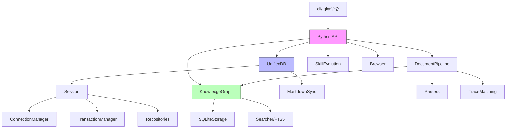
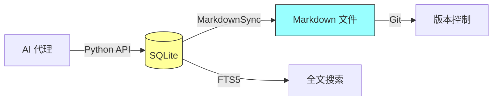

# 知识图谱 (INDEX.md)

> QuickAgents v2.9.0 项目文档导航与知识关系索引
> 产品化改造进行中 → v2.10.0

---

## 文档导航

### 目录结构

```
项目根目录
├── README.md ───────────── 项目说明（中英双语）
├── AGENTS.md ───────────── 开发规范（核心文件）
├── CHANGELOG.md ────────── 变更日志
├── VERSION.md ──────────── 版本信息
├── pyproject.toml ──────── Python 包配置
│
├── quickagents/ ────────── Python 包源代码
│   ├── __init__.py ─────── 公共 API 导出
│   ├── core/ ──────────── 核心模块
│   │   ├── unified_db.py ─── UnifiedDB 门面类
│   │   ├── session.py ────── Session 统一接口
│   │   ├── connection_manager.py ── 连接池管理
│   │   ├── transaction_manager.py ─ 事务管理
│   │   ├── migration_manager.py ─── 迁移管理
│   │   ├── markdown_sync.py ──── Markdown 同步
│   │   ├── evolution.py ──────── 自我进化
│   │   ├── file_manager.py ───── 文件管理
│   │   ├── loop_detector.py ──── 循环检测
│   │   ├── reminder.py ──────── 事件提醒
│   │   ├── cache_db.py ──────── 缓存数据库
│   │   ├── git_hooks.py ─────── Git 钩子
│   │   ├── memory.py ────────── 记忆辅助函数
│   │   └── repositories/ ────── 仓库层
│   │       ├── query_builder.py ── Django 风格查询构建器
│   │       ├── base.py ─────────── BaseRepository
│   │       ├── memory_repo.py ──── MemoryRepository
│   │       ├── task_repo.py ────── TaskRepository
│   │       ├── progress_repo.py ── ProgressRepository
│   │       └── feedback_repo.py ── FeedbackRepository
│   │
│   ├── knowledge_graph/ ── 知识图谱模块
│   │   ├── knowledge_graph.py ── KG 门面类
│   │   ├── interfaces.py ─────── 接口定义
│   │   ├── types.py ──────────── 类型定义 (NodeType, EdgeType)
│   │   ├── exceptions.py ─────── 异常定义
│   │   ├── core/ ────────────── 核心逻辑
│   │   │   ├── searcher.py ───── FTS5 搜索 + 批量扩展
│   │   │   └── ...
│   │   └── storage/ ─────────── 存储层
│   │       └── sqlite_storage.py ── WAL 模式 + 批量查询
│   │
│   ├── document/ ───────── 文档管道模块
│   │   ├── pipeline.py ─────── 三层管道
│   │   ├── parsers/ ────────── 7 个文档解析器
│   │   ├── extractors/ ─────── 知识提取器
│   │   ├── matching/ ───────── 三级追踪匹配
│   │   ├── validators/ ─────── 交叉验证
│   │   ├── storage/ ────────── 知识存储
│   │   ├── ocr/ ───────────── OCR 支持
│   │   ├── models.py ──────── 数据模型
│   │   └── tests/ ─────────── 文档测试
│   │
│   ├── browser/ ────────── 浏览器自动化
│   ├── yugong/ ────────── 愚公自主循环引擎 (NEW v2.9.0)
│   │   ├── models.py ──── 数据模型 (UserStory, LoopResult, LoopState)
│   │   ├── config.py ──── YuGongConfig
│   │   ├── db.py ──────── YuGongDB SQLite持久化 (7张表)
│   │   ├── llm_client.py ── LLMClient + LLMConfig (OpenAI兼容)
│   │   ├── tool_executor.py ── ToolExecutor (7个内置工具)
│   │   ├── agent_executor.py ── AgentExecutor (多轮对话+工具调用)
│   │   ├── autonomous_loop.py ── YuGongLoop 核心引擎
│   │   ├── requirement_parser.py ── 需求解析器
│   │   ├── task_orchestrator.py ── 任务编排器
│   │   ├── safety_guard.py ── 安全守护
│   │   ├── exit_detector.py ── 退出检测器
│   │   ├── context_injector.py ── 上下文注入器
│   │   ├── progress_logger.py ── 进度日志
│   │   └── report_generator.py ── 报告生成器 (Markdown+JSON)
│   ├── cli/ ────────────── CLI 命令 (qka)
│   ├── skills/ ─────────── 技能模块 (TDD/Git/反馈)
│   └── utils/ ──────────── 工具模块 (编码/编辑器)
│
├── tests/ ──────────────── 测试文件 (907 tests)
│   └── yugong/ ────────── YuGong测试 (242 tests)
│
├── Docs/ ───────────────── 项目文档
│   ├── MEMORY.md ──────── 项目记忆（三维记忆系统）
│   ├── TASKS.md ───────── 任务管理
│   ├── DESIGN.md ──────── 设计文档
│   ├── INDEX.md ───────── 知识图谱（本文件）
│   ├── DECISIONS.md ───── 决策日志
│   ├── ARCHITECTURE.md ── 系统架构
│   ├── API_REFERENCE.md ─ API 参考文档
│   ├── USER_GUIDE.md ──── 用户指南
│   ├── EXAMPLES.md ────── 使用示例
│   ├── AGENT_GUIDE.md ─── Agent 使用指南
│   ├── guide/
│   │   └── installation.md ─── 安装指南
│   ├── guides/
│   │   ├── UNINSTALL_GUIDE.md ── 卸载指南
│   │   └── TOOL_ERROR_FIX_GUIDE.md ── 工具错误修复
│   ├── en/ ────────────── 英文文档
│   ├── enhancement-analysis/ ── 产品化方案文档
│   │   ├── quickagents-productization-plan.md ── 产品化方案 v1.0
│   │   ├── yugong-loop-design.md ── YuGong技术设计文档 (70KB)
│   │   └── IMPLEMENTATION_PLAN.md ── 实施计划
│   ├── document-module-extraction.md ── 文档模块说明
│
└── .opencode/ ─────────── OpenCode 配置
    ├── agents/ ────────── 代理配置
    ├── skills/ ────────── 9个技能 (产品化治理后)
    ├── commands/ ──────── 命令配置
    ├── hooks/ ─────────── 钩子配置
    ├── config/ ────────── 配置文件
    ├── memory/ ────────── 项目记忆（与 Docs/ 同步）
    └── plugins/ ───────── 插件目录
```

---

## 知识关系图

### 模块依赖关系



### 数据同步关系



---

## 快速参考

### 核心文档

| 文档 | 用途 | 最后更新 |
|------|------|----------|
| [AGENTS.md](../AGENTS.md) | 开发规范与工作流程 | 2026-04-06 |
| [DESIGN.md](./DESIGN.md) | 系统设计文档 | 2026-04-06 |
| [ARCHITECTURE.md](./ARCHITECTURE.md) | 系统架构文档 | 2026-04-05 |
| [API_REFERENCE.md](./API_REFERENCE.md) | API 参考文档 | 2026-04-05 |
| [CHANGELOG.md](../CHANGELOG.md) | 变更日志 | 2026-04-05 |
| [VERSION.md](../VERSION.md) | 版本信息 | 2026-04-05 |
| [README.md](../README.md) | 项目说明 | 2026-04-05 |
| [产品化方案](./enhancement-analysis/quickagents-productization-plan.md) | 产品化改造方案 | 2026-04-06 |
| [YuGong设计](./enhancement-analysis/yugong-loop-design.md) | 愚公循环技术设计 | 2026-04-06 |

### Python 模块索引

| 模块 | 入口类/函数 | 核心功能 |
|------|-------------|----------|
| `quickagents.core.unified_db` | `UnifiedDB` | 统一数据库门面 |
| `quickagents.core.session` | `Session` | 数据库会话接口 |
| `quickagents.core.connection_manager` | `ConnectionManager` | 动态连接池 |
| `quickagents.core.transaction_manager` | `TransactionManager` | ACID 事务 |
| `quickagents.core.markdown_sync` | `MarkdownSync` | Markdown 同步 |
| `quickagents.core.evolution` | `SkillEvolution` | 自我进化 |
| `quickagents.core.loop_detector` | `LoopDetector` | 循环检测 |
| `quickagents.core.reminder` | `Reminder` | 事件提醒 |
| `quickagents.core.file_manager` | `FileManager` | 文件管理 |
| `quickagents.core.memory` | `update_memory`, `add_experiential_memory` | 记忆辅助函数 |
| `quickagents.knowledge_graph.knowledge_graph` | `KnowledgeGraph` | 知识图谱门面 |
| `quickagents.knowledge_graph.storage.sqlite_storage` | `SQLiteGraphStorage` | WAL + 批量查询 |
| `quickagents.knowledge_graph.core.searcher` | `Searcher` | FTS5 搜索 |
| `quickagents.document.pipeline` | `DocumentPipeline` | 文档管道 |
| `quickagents.yugong.autonomous_loop` | `YuGongLoop` | 愚公自主循环核心引擎 |
| `quickagents.yugong.agent_executor` | `AgentExecutor`, `AgentConfig` | 多轮对话+工具调用 Agent |
| `quickagents.yugong.llm_client` | `LLMClient`, `LLMConfig` | OpenAI兼容LLM客户端 |
| `quickagents.yugong.tool_executor` | `ToolExecutor` | 7个内置工具(文件读写/命令执行) |
| `quickagents.yugong.db` | `YuGongDB` | YuGong SQLite持久化(7张表) |
| `quickagents.yugong.report_generator` | `ReportGenerator` | Markdown+JSON双格式报告 |
| `quickagents.yugong.models` | `UserStory`, `LoopResult`, `LoopState` | 数据模型 |
| `quickagents.yugong.config` | `YuGongConfig` | 配置类 |
| `quickagents.browser` | `Browser` | 浏览器自动化 |

### OpenCode 配置

| 文档 | 用途 |
|------|------|
| [.opencode/agents/](../.opencode/agents/) | 15 个代理配置 |
| [.opencode/skills/](../.opencode/skills/) | 9个技能配置 (产品化治理后) |
| [.opencode/commands/](../.opencode/commands/) | 6 个命令配置 |
| [.opencode/config/categories.json](../.opencode/config/categories.json) | Category 系统 |

---

## 关键概念

### 三维记忆系统

| 概念 | 定义 | 用途 |
|------|------|------|
| **Factual Memory** | 事实记忆 | 项目名称、技术栈、架构决策 |
| **Experiential Memory** | 经验记忆 | 踩坑记录、最佳实践 |
| **Working Memory** | 工作记忆 | 当前任务、进度、阻塞点 |

### 知识图谱 (v2.8.3)

| 概念 | 定义 | 用途 |
|------|------|------|
| **KGNode** | 知识节点 | 需求/决策/功能/文档/模块 |
| **KGEdge** | 知识关系 | traces_to/implements/depends_on |
| **FTS5 Search** | 全文搜索 | 前缀搜索，支持 CJK |
| **Batch Queries** | 批量查询 | 消除 N+1 问题 |

### 性能优化 (v2.8.3)

| 概念 | 定义 | 用途 |
|------|------|------|
| **WAL Mode** | Write-Ahead Logging | 读写并发 |
| **Thread-Local Connection** | 线程本地持久连接 | 避免连接创建开销 |
| **Batch SQL** | 批量 SQL 查询 | 2N+M → 2 queries |
| **Parallel Sync** | 并行 Markdown 同步 | ThreadPoolExecutor |

---

### YuGong 愚公自主循环 (v2.9.0 NEW)

| 概念 | 定义 | 用途 |
|------|------|------|
| **YuGongLoop** | 自主循环引擎 | 需求→完整项目全自动执行 |
| **AgentExecutor** | 多轮对话Agent | LLM推理+工具调用循环 |
| **LLMClient** | OpenAI兼容客户端 | 支持ZhipuAI/OpenAI/任何兼容API |
| **ToolExecutor** | 工具执行器 | 7个内置工具(文件读写/命令执行) |
| **YuGongDB** | SQLite持久化 | 7张表存储循环状态/Story/迭代 |
| **ReportGenerator** | 报告生成 | Markdown+JSON双格式输出 |

---

*最后更新: 2026-04-06 | v2.9.0 (产品化改造中 → v2.10.0)*
