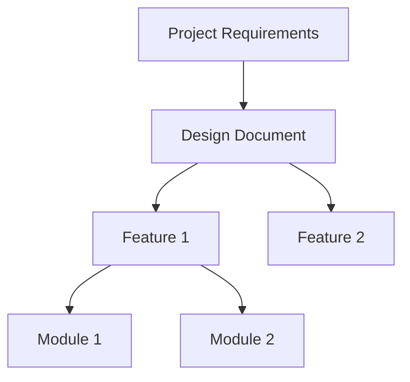

# Knowledge Graph Index (INDEX.md)

> Document navigation and knowledge relationships

---

## Document Navigation

```
Project Root
├── AGENTS.md ─────────── Development Guidelines (this document)
├── Project Requirements.md ─ Original Requirements
└── Docs/
    ├── MEMORY.md ──────── Project Memory
    ├── TASKS.md ───────── Task Management
    ├── DESIGN.md ──────── Design Document
    ├── INDEX.md ───────── Knowledge Graph (this file)
    ├── DECISIONS.md ───── Decision Log
    ├── features/ ──────── Feature Documentation
    └── modules/ ───────── Module Documentation
```

---

## Knowledge Relationship Graph



---

## Quick Reference

| Topic | Document Location | Last Updated |
|-------|-------------------|--------------|
| | | |

---

## Key Concepts

- **Concept 1**: Definition
- **Concept 2**: Definition

---

*This file will be automatically populated when you run "QuickAgent" initialization.*
