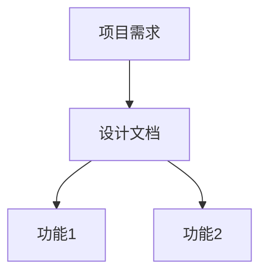

# Knowledge Index Skill

## 概述

Knowledge Index Skill 是一个用于构建和维护项目知识图谱的技能，提供文档导航、知识关系可视化和快速检索功能。

## 核心能力

### 1. 文档导航

- 自动生成项目文档目录结构
- 提供文档间的导航链接
- 维护文档最后更新时间

### 2. 知识关系图

- 可视化文档间的关系
- 展示功能与模块的依赖
- 生成Mermaid图表

### 3. 快速参考

- 关键概念定义
- 主题索引
- 术语表

## 使用场景

### 场景1：项目初始化

创建项目级INDEX.md知识图谱。

### 场景2：功能/模块创建

为新功能或模块创建INDEX.md。

### 场景3：文档更新

当文档结构变更时，更新知识图谱。

## INDEX.md 结构

### 1. 文档导航

```markdown
## 文档导航

### 目录结构

```
项目根目录
├── AGENTS.md
├── Docs/
│   ├── MEMORY.md
│   ├── TASKS.md
│   ├── DESIGN.md
│   └── INDEX.md
└── ...
```
```

### 2. 知识关系图

```markdown
## 知识关系图

### 整体关系


```

### 3. 快速参考

```markdown
## 快速参考

### 核心文档

| 文档 | 用途 | 最后更新 |
|------|------|----------|
| AGENTS.md | 开发规范 | 2026-03-22 |
```
```

### 4. 关键概念

```markdown
## 关键概念

### 概念名称

| 概念 | 定义 | 用途 |
|------|------|------|
| xxx | 定义说明 | 使用场景 |
```

## 图表类型

### 1. 目录结构图

使用ASCII树形图展示目录结构。

### 2. 知识关系图

使用Mermaid graph TD 展示层级关系。

### 3. 文档依赖图

使用Mermaid graph LR 展示依赖关系。

### 4. 实体关系图

使用Mermaid erDiagram 展示数据关系。

## 触发规则

### 自动触发

1. **项目初始化**：创建项目级INDEX.md
2. **功能/模块创建**：创建对应的INDEX.md
3. **文档结构变更**：更新相关INDEX.md

### 手动触发

- 「更新索引」
- 「生成知识图谱」
- 「查看文档关系」

## 维护规则

### 更新时机

1. 新增文档时
2. 文档重命名/移动时
3. 功能/模块结构变更时
4. 定期检查（每周）

### 更新内容

1. 目录结构
2. 知识关系图
3. 快速参考表
4. 最后更新时间

## 最佳实践

### 命名规范

- 功能目录：`features/{feature-name}/`
- 模块目录：`modules/{module-name}/`
- 使用kebab-case命名

### 关系维护

1. 保持关系的准确性
2. 及时清理过期关系
3. 避免循环依赖

### 可视化原则

1. 图表简洁明了
2. 层级不超过4层
3. 使用一致的样式

---

*版本: 1.0.0 | 创建时间: 2026-03-22*
