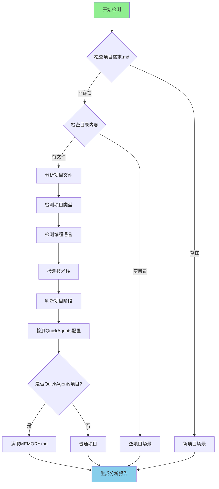

# Project Detector Skill

## 技能描述

项目检测技能，用于智能分析项目目录，识别项目类型、编程语言、技术栈和项目阶段。

## 核心能力

### 1. 项目类型检测

| 项目类型 | 检测规则 | 置信度 |
|---------|---------|--------|
| **Web应用** | package.json + index.html + src/ | 高 |
| **API服务** | package.json + server.js/app.js + routes/ | 高 |
| **CLI工具** | package.json + bin/ + cli.js | 高 |
| **移动应用** | app.json/App.tsx/MainActivity.java | 高 |
| **桌面应用** | electron/main.go/MainWindow.xaml | 高 |
| **库/组件** | package.json + lib/ + index.d.ts | 中 |
| **全栈应用** | 前端+后端特征混合 | 中 |

### 2. 编程语言识别

| 语言 | 检测文件 | 框架特征 |
|------|---------|---------|
| **JavaScript** | .js, .jsx, .mjs | React, Vue, Angular |
| **TypeScript** | tsconfig.json, .ts, .tsx | Next.js, NestJS, Angular |
| **Python** | requirements.txt, setup.py, .py | Django, Flask, FastAPI |
| **Go** | go.mod, .go | Gin, Echo |
| **Rust** | Cargo.toml, .rs | Actix, Rocket |
| **Java** | pom.xml, build.gradle, .java | Spring Boot |
| **C#** | .csproj, .sln, .cs | .NET Core |

### 3. 技术栈识别

#### 前端框架

```yaml
React:
  indicators: [react, react-dom]
  files: [package.json]
  confidence: high

Vue:
  indicators: [vue]
  files: [package.json]
  confidence: high

Angular:
  indicators: [@angular/core, angular.json]
  files: [package.json, angular.json]
  confidence: high

Next.js:
  indicators: [next, next.config.js]
  files: [package.json, next.config.js]
  confidence: high

Svelte:
  indicators: [svelte, svelte.config.js]
  files: [package.json, svelte.config.js]
  confidence: high
```

#### 后端框架

```yaml
Express:
  indicators: [express]
  files: [package.json]
  confidence: high

NestJS:
  indicators: [@nestjs/core, nest-cli.json]
  files: [package.json, nest-cli.json]
  confidence: high

Koa:
  indicators: [koa]
  files: [package.json]
  confidence: high

Django:
  indicators: [django, settings.py]
  files: [requirements.txt, settings.py]
  confidence: high

Flask:
  indicators: [flask, app.py]
  files: [requirements.txt, app.py]
  confidence: medium
```

#### 数据库

```yaml
PostgreSQL:
  indicators: [pg, postgres, psycopg2]
  confidence: high

MySQL:
  indicators: [mysql, mysql2]
  confidence: high

MongoDB:
  indicators: [mongoose, mongodb]
  confidence: high

SQLite:
  indicators: [sqlite3, better-sqlite3]
  confidence: high

Redis:
  indicators: [redis, ioredis]
  confidence: high
```

### 4. 项目阶段判断

| 阶段 | 判断依据 | 置信度 |
|------|---------|--------|
| **初始化** | 仅有配置文件，无src/或极少代码 | 高 |
| **开发中** | 有src/和代码，但缺少测试/文档 | 高 |
| **测试阶段** | 有tests/和测试配置 | 高 |
| **生产就绪** | 完整的文档、测试、CI/CD配置 | 高 |
| **维护阶段** | Docs/MEMORY.md存在，有历史记录 | 高 |

### 5. QuickAgents项目识别

检测项目是否已经使用QuickAgents：

```yaml
QuickAgents项目:
  indicators:
    - AGENTS.md存在
    - .opencode/目录存在
    - Docs/目录存在
    - Docs/MEMORY.md存在
  confidence: high
```

## 检测流程



## 检测规则

### 项目类型检测

```python
# 伪代码示例
def detect_project_type(directory):
    score = {
        'web-application': 0,
        'api-service': 0,
        'cli-tool': 0,
        'mobile-app': 0,
        'desktop-app': 0,
        'library': 0
    }
    
    # Web应用检测
    if has_file('index.html'):
        score['web-application'] += 30
    if has_file('package.json') and has_dependency('react', 'vue', 'angular'):
        score['web-application'] += 40
    if has_directory('src/components'):
        score['web-application'] += 20
        
    # API服务检测
    if has_file('server.js', 'app.js'):
        score['api-service'] += 30
    if has_directory('routes', 'controllers'):
        score['api-service'] += 30
    if has_dependency('express', 'koa', 'fastify'):
        score['api-service'] += 40
        
    # 返回得分最高的类型
    return max(score, key=score.get)
```

### 技术栈检测

```python
def detect_tech_stack(directory):
    tech_stack = {
        'frontend': [],
        'backend': [],
        'database': [],
        'tools': []
    }
    
    # 读取package.json
    if has_file('package.json'):
        deps = read_package_json().get('dependencies', {})
        
        # 前端框架
        if 'react' in deps:
            tech_stack['frontend'].append('React')
        if 'vue' in deps:
            tech_stack['frontend'].append('Vue')
        if 'next' in deps:
            tech_stack['frontend'].append('Next.js')
            
        # 后端框架
        if 'express' in deps:
            tech_stack['backend'].append('Express')
        if '@nestjs/core' in deps:
            tech_stack['backend'].append('NestJS')
            
        # 数据库
        if 'pg' in deps or 'postgres' in deps:
            tech_stack['database'].append('PostgreSQL')
        if 'mongoose' in deps:
            tech_stack['database'].append('MongoDB')
            
    return tech_stack
```

## 输出格式

### 分析报告模板

```markdown
📊 项目分析报告

## 基本信息
• 项目类型：{project_type}
• 编程语言：{language}
• 项目阶段：{stage}
• QuickAgents状态：{qa_status}

## 技术栈
• 前端：{frontend_frameworks}
• 后端：{backend_frameworks}
• 数据库：{databases}
• 工具：{tools}

## 项目结构
• 核心目录：{core_directories}
• 配置文件：{config_files}
• 文档状态：{docs_status}

## 建议操作
{recommendations}
```

## 使用示例

### 示例1：检测React项目

```
输入：检测项目目录

输出：
📊 项目分析报告

• 项目类型：Web应用
• 编程语言：TypeScript
• 项目阶段：开发中（约60%）
• QuickAgents状态：未使用

## 技术栈
• 前端：React, Next.js
• 后端：Next.js API Routes
• 数据库：PostgreSQL (Prisma)
• 工具：ESLint, Prettier, Jest

## 建议操作
[A] 继续开发 - 识别为现有项目
[B] 重新开始 - 清空并重新初始化
```

### 示例2：检测空目录

```
输入：检测项目目录

输出：
📊 项目分析报告

• 项目类型：未知（空目录）
• 编程语言：未检测到
• 项目阶段：初始化
• QuickAgents状态：未使用

## 建议操作
这是一个空项目目录，建议：
1. 描述您的项目需求
2. 选择合适的技术栈
3. 开始项目初始化流程
```

### 示例3：检测QuickAgents项目

```
输入：检测项目目录

输出：
📊 项目分析报告

• 项目类型：Web应用
• 编程语言：TypeScript
• 项目阶段：开发中（约92%）
• QuickAgents状态：✅ 已使用

## 现有配置
• AGENTS.md：存在
• Docs/MEMORY.md：存在
• 当前任务：T007 Skill管理系统
• 最新提交：8da74eb

## 建议操作
[A] 继续开发 - 恢复上次进度
[B] 查看详情 - 查看完整MEMORY.md
```

## 注意事项

1. **检测顺序**：按优先级从高到低检测（项目需求.md → 目录内容 → 文件特征）
2. **置信度**：所有检测结果都附带置信度评估
3. **用户确认**：关键判断需要用户确认
4. **性能优化**：大型项目采用异步检测，避免阻塞
5. **兼容性**：支持主流技术栈和框架

## 依赖

- 无外部依赖
- 需要文件系统访问权限
- 需要.opencode/skills/目录

## 版本

- **版本号**：1.0.0
- **创建时间**：2026-03-25
- **作者**：QuickAgents Team
