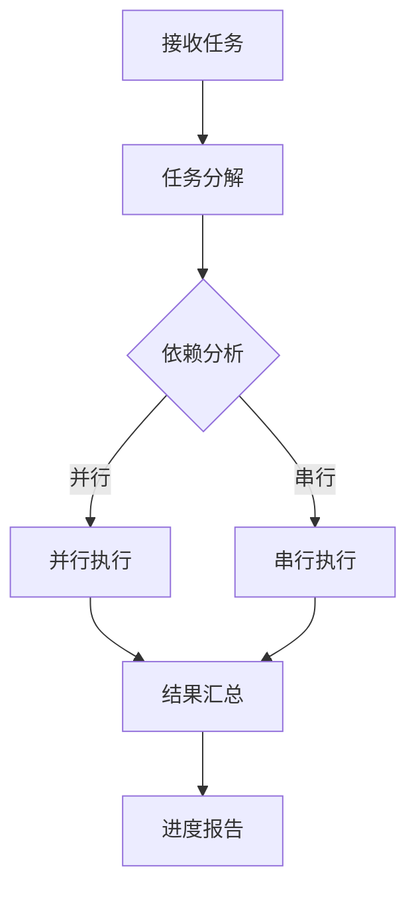

# QuickAgents API 参考文档

> 完整的API文档与配置规范

---

## 目录

1. [Python API (核心)](#python-api-核心)
2. [代理API](#代理api)
3. [技能API](#技能api)
4. [命令API](#命令api)
5. [配置API](#配置api)
6. [数据结构](#数据结构)
7. [错误处理](#错误处理)

---

## Python API (核心)

### UnifiedDB — 统一数据库

```python
from quickagents import UnifiedDB, MemoryType, TaskStatus, FeedbackType

db = UnifiedDB('.quickagents/unified.db')
```

#### 记忆操作

| 方法 | 说明 | 返回值 |
|------|------|--------|
| `set_memory(key, value, memory_type, **kwargs)` | 设置记忆 | None |
| `get_memory(key)` | 获取记忆值 | str or None |
| `get_all_memories()` | **v2.8.3** 批量获取所有记忆 | List[Memory] |
| `search_memory(query, memory_type)` | 搜索记忆 | List[Memory] |
| `delete_memory(key)` | 删除记忆 | bool |

```python
db.set_memory('project.name', 'MyProject', MemoryType.FACTUAL)
db.set_memory('current.task', '实现认证', MemoryType.WORKING)
db.set_memory('lesson.001', '避免过度工程', MemoryType.EXPERIENTIAL, category='pitfalls')

name = db.get_memory('project.name')
all_memories = db.get_all_memories()  # v2.8.3 批量获取
results = db.search_memory('认证', MemoryType.EXPERIENTIAL)
```

#### 任务操作

| 方法 | 说明 | 返回值 |
|------|------|--------|
| `add_task(task_id, name, priority, **kwargs)` | 添加任务 | None |
| `update_task_status(task_id, status)` | 更新任务状态 | None |
| `get_tasks(status)` | 获取任务列表 | List[Task] |
| `get_task(task_id)` | 获取单个任务 | Task or None |

```python
db.add_task('T001', '实现认证', 'P0')
db.update_task_status('T001', TaskStatus.COMPLETED)
tasks = db.get_tasks(status=TaskStatus.PENDING)
```

#### 进度追踪

| 方法 | 说明 | 返回值 |
|------|------|--------|
| `init_progress(project_id, total_tasks)` | 初始化进度 | None |
| `update_progress(field, value)` | 更新进度字段 | None |
| `get_progress()` | 获取当前进度 | dict |

#### 反馈收集

| 方法 | 说明 | 返回值 |
|------|------|--------|
| `add_feedback(feedback_type, title, **kwargs)` | 添加反馈 | None |
| `get_feedbacks(feedback_type, limit)` | 获取反馈列表 | List[Feedback] |

### 记忆辅助函数

```python
from quickagents import update_memory, update_memories, add_experiential_memory, sync_all_memory

update_memory('project.name', 'MyProject')
update_memory('current.task', '实现认证', MemoryType.WORKING)
add_experiential_memory('避免过度工程', category='pitfalls')
update_memories({'key1': 'val1', 'key2': 'val2'})
sync_all_memory()
```

### MarkdownSync — Markdown 同步

```python
from quickagents import UnifiedDB, MarkdownSync

db = UnifiedDB('.quickagents/unified.db')
sync = MarkdownSync(db)

sync.sync_all()      # v2.8.3 并行同步（3 workers）
sync.sync_memory()   # v2.8.3 批量查询优化
sync.sync_tasks()
sync.sync_feedback()
sync.sync_decisions()
```

### KnowledgeGraph — 知识图谱

```python
from quickagents import KnowledgeGraph, NodeType, EdgeType

kg = KnowledgeGraph()

node = kg.create_node(
    node_type=NodeType.REQUIREMENT,
    title='用户认证需求',
    content='实现JWT认证'
)

kg.create_edge(
    source_id=node.id,
    target_id='T001',
    edge_type=EdgeType.TRACES_TO
)

results = kg.search('认证')
trace = kg.trace_requirement(node.id)

kg.close()  # v2.8.3 资源清理
```

#### KnowledgeGraph 新方法 (v2.8.3)

| 方法 | 说明 |
|------|------|
| `close()` | 关闭底层存储连接，释放资源 |
| `search_fts(query, ...)` | FTS5 前缀搜索（支持 CJK） |
| `count_fts(query, ...)` | FTS5 搜索结果计数 |

### SkillEvolution — 自我进化

```python
from quickagents import get_evolution

evolution = get_evolution()

evolution.on_task_complete({
    'task_id': 'T001',
    'task_name': '实现认证',
    'skills_used': ['tdd-workflow-skill'],
    'success': True,
    'duration_ms': 45000
})

evolution.on_git_commit()

if evolution.check_periodic_trigger():
    evolution.run_periodic_optimization()
```

### Browser — 浏览器自动化

```python
from quickagents import Browser

browser = Browser()
page = browser.new_page()
logs = page.get_console_logs()
requests = page.get_network_requests()
result = page.evaluate('document.title')
browser.close()
```

### DocumentPipeline — 文档管道

```python
from quickagents.document import DocumentPipeline

pipeline = DocumentPipeline()
result = pipeline.process_directory('PALs/', with_source=True)
```

---

## 代理API

### 代理调用方式

#### @提及调用

```text
@agent-name <instruction>
```

**参数**：
- `agent-name`: 代理名称（如yinglong-init）
- `instruction`: 具体指令

**示例**：
```
@jianming-review 审查src/auth.ts文件
@lishou-test 运行所有单元测试
```

#### 智能调度

Orchestrator会自动识别任务场景并调度合适的代理：

```text
@fenghou-orchestrate 完成用户认证功能
```

系统将自动：
1. 分解任务
2. 调度相关代理
3. 协调执行顺序
4. 汇总结果

### 代理配置规范

#### 基本结构

```yaml
---
description: 代理的简要描述
mode: subagent | primary
model: provider/model-id
temperature: 0.1-0.8
tools:
  write: true | false
  edit: true | false | ask
  bash: true | false | ask
permission:
  edit: allow | ask | deny
  bash:
    "*": ask
    "git *": allow
---
```

#### 配置字段说明

| 字段 | 类型 | 必填 | 说明 |
|------|------|------|------|
| `description` | string | 是 | 代理功能描述 |
| `mode` | enum | 是 | `subagent`（子代理）或`primary`（主代理） |
| `model` | string | 是 | 使用的模型，格式：`provider/model-id` |
| `temperature` | float | 否 | 创造性程度，0.1-0.8 |
| `tools.write` | boolean | 否 | 是否允许写入文件 |
| `tools.edit` | boolean/ask | 否 | 是否允许编辑文件 |
| `tools.bash` | boolean/ask | 否 | 是否允许执行bash命令 |
| `permission.edit` | enum | 否 | 编辑权限：allow/ask/deny |
| `permission.bash` | object | 否 | Bash权限配置 |

#### 完整示例

```yaml
---
description: 代码审查专家，专注于代码质量、最佳实践和潜在问题
mode: subagent
model: glm-5
temperature: 0.3
tools:
  write: false
  edit: false
  bash: false
permission:
  edit: deny
  bash:
    "*": deny
---

# Code Reviewer Agent

## 职责

作为代码审查专家，负责：

1. 代码质量审查
2. 最佳实践检查
3. 潜在问题识别
4. 安全漏洞检测

## 工作流程

### 阶段1：快速扫描
- 代码风格检查
- 命名规范检查
- 结构合理性检查

### 阶段2：深度审查
- 逻辑正确性验证
- 边界条件检查
- 性能问题识别
- 安全风险评估

## 输出格式

```markdown
## 代码审查报告

### 概览
- 文件数：X
- 问题数：Y（严重：A，警告：B，建议：C）

### 严重问题
1. [文件:行号] 问题描述

### 警告
1. [文件:行号] 问题描述

### 建议
1. [文件:行号] 改进建议
```
```

### 代理列表

#### 核心代理

| 代理 | 模式 | 模型 | 权限 |
|------|------|------|------|
| `yinglong-init` | primary | glm-5 | 读写 |
| `boyi-consult` | subagent | glm-5 | 只读 |
| `chisongzi-advise` | subagent | glm-5 | 只读 |
| `cangjie-doc` | subagent | glm-5 | 读写 |
| `huodi-skill` | subagent | glm-5 | 读写 |
| `fenghou-orchestrate` | primary | glm-5 | 全部 |

#### 质量代理

| 代理 | 模式 | 模型 | 权限 |
|------|------|------|------|
| `jianming-review` | subagent | glm-5 | 只读 |
| `lishou-test` | subagent | glm-5 | bash |
| `mengzhang-security` | subagent | glm-5 | 只读 |
| `hengge-perf` | subagent | glm-5 | bash |

#### 工具代理

| 代理 | 模式 | 模型 | 权限 |
|------|------|------|------|
| `kuafu-debug` | subagent | glm-5 | 编辑 |
| `gonggu-refactor` | subagent | glm-5 | 编辑 |
| `huodi-deps` | subagent | glm-5 | bash |
| `hengge-cicd` | subagent | glm-5 | bash |

---

## 技能API

### 技能调用方式

#### 自动触发

某些技能会在特定条件下自动触发：

- `inquiry-skill`: 发送"启动QuickAgent"时
- `git-commit-skill`: Git提交时
- `todo-continuation-enforcer`: 检测到idle时

#### 间接调用

通过代理间接调用技能：

```
@fenghou-orchestrate 使用tdd-workflow开发用户认证
```

### 技能配置规范

#### 基本结构

```
skill-name/
├── SKILL.md           # 技能说明文档（必需）
├── scripts/           # 脚本文件（可选）
│   └── *.sh
├── references/        # 参考文档（可选）
│   └── *.md
└── assets/           # 资源文件（可选）
    └── *
```

#### SKILL.md规范

```markdown
---
skill_name: skill-name
version: 1.0.0
description: 技能的简要描述
triggers:
  - trigger_condition_1
  - trigger_condition_2
dependencies:
  - dependency_1
  - dependency_2
---

# Skill Name

## 功能说明

详细描述技能的功能和用途。

## 使用场景

描述适用场景和最佳实践。

## 工作流程

### 步骤1：准备
详细步骤...

### 步骤2：执行
详细步骤...

### 步骤3：验证
详细步骤...

## 配置选项

| 选项 | 类型 | 默认值 | 说明 |
|------|------|--------|------|
| option1 | string | "default" | 选项说明 |

## 示例

### 示例1：基本用法
```bash
command example
```

### 示例2：高级用法
```bash
advanced command example
```

## 注意事项

- 注意事项1
- 注意事项2
```

### 技能列表

| 技能 | 版本 | 触发方式 | 用途 |
|------|------|---------|------|
| `inquiry-skill` | 1.0.0 | 自动 | 12轮需求澄清 |
| `project-memory-skill` | 2.0.0 | 自动 | 三维记忆系统 |
| `tdd-workflow-skill` | 1.0.0 | 手动 | TDD工作流 |
| `git-commit-skill` | 1.0.0 | 自动 | Git提交规范 |
| `code-review-skill` | 1.0.0 | 手动 | 代码审查 |
| `category-system-skill` | 1.0.0 | 自动 | Category分类 |
| `background-agents-skill` | 1.0.0 | 手动 | 后台并行 |
| `boulder-tracking-skill` | 1.0.0 | 自动 | 进度追踪 |
| `skill-integration-skill` | 1.0.0 | 手动 | 技能整合 |
| `multi-model-skill` | 1.0.0 | 自动 | 多模型协同 |
| `lsp-ast-skill` | 1.0.0 | 手动 | LSP/AST集成 |

---

## 命令API

### 命令调用方式

```bash
/command-name [arguments]
```

### 命令配置规范

#### 基本结构

```yaml
---
name: command-name
description: 命令的简要描述
trigger: /command-name
agent: agent-to-invoke
parameters:
  - name: param1
    type: string
    required: true
    description: 参数说明
---
```

#### 完整示例

```yaml
---
name: ultrawork
description: 超高效工作命令，一键完成复杂任务
trigger: /ultrawork
agent: fenghou-orchestrate
parameters:
  - name: task
    type: string
    required: true
    description: 要完成的任务描述
  - name: parallel
    type: boolean
    required: false
    default: true
    description: 是否并行执行子任务
---

# Ultrawork Command

## 功能

一键完成复杂任务，系统自动：
1. 分解任务为子任务
2. 识别依赖关系
3. 并行执行可并行部分
4. 串行执行依赖部分
5. 汇总结果并报告

## 使用示例

### 基本用法
```bash
/ultrawork 实现用户认证功能
```

### 指定串行执行
```bash
/ultrawork 实现用户认证功能 --parallel=false
```

## 工作流程


```

### 命令列表

| 命令 | 触发词 | 代理 | 用途 |
|------|--------|------|------|
| `ultrawork` | `/ultrawork` | fenghou-orchestrate | 超高效执行任务 |
| `start-work` | `/start-work` | fenghou-orchestrate | 跨会话恢复 |

---

## 配置API

### Category配置

#### 文件位置

`.opencode/config/categories.json`

#### Schema

```json
{
  "$schema": "http://json-schema.org/draft-07/schema#",
  "type": "object",
  "properties": {
    "categories": {
      "type": "object",
      "patternProperties": {
        "^[a-z-]+$": {
          "type": "object",
          "properties": {
            "description": {
              "type": "string"
            },
            "primary": {
              "type": "string"
            },
            "fallback": {
              "type": "array",
              "items": {
                "type": "string"
              }
            },
            "keywords": {
              "type": "array",
              "items": {
                "type": "string"
              }
            },
            "file_patterns": {
              "type": "array",
              "items": {
                "type": "string"
              }
            }
          },
          "required": ["description", "primary"]
        }
      }
    }
  },
  "required": ["categories"]
}
```

#### 完整示例

```json
{
  "categories": {
    "visual-engineering": {
      "description": "UI开发、前端设计、视觉任务",
      "primary": "gemini-2.0-flash",
      "fallback": ["gpt-5.4", "glm-5"],
      "keywords": ["UI", "前端", "样式", "CSS", "组件"],
      "file_patterns": ["*.vue", "*.tsx", "*.css", "*.scss"]
    },
    "ultrabrain": {
      "description": "深度推理、复杂分析、架构设计",
      "primary": "gpt-5.4",
      "fallback": ["glm-5-plus", "gemini-2.0-flash"],
      "keywords": ["架构", "设计", "分析", "推理", "复杂"],
      "file_patterns": []
    },
    "quick": {
      "description": "快速响应、简单任务、日常操作",
      "primary": "glm-5-flash",
      "fallback": ["gpt-4o-mini"],
      "keywords": ["快速", "简单", "格式化", "重命名"],
      "file_patterns": []
    },
    "planning": {
      "description": "计划制定、需求分析、任务分解",
      "primary": "glm-5",
      "fallback": ["gpt-5.4"],
      "keywords": ["计划", "需求", "分解", "安排"],
      "file_patterns": []
    }
  }
}
```

### 模型配置

#### 文件位置

`.opencode/config/models.json`

#### Schema

```json
{
  "$schema": "http://json-schema.org/draft-07/schema#",
  "type": "object",
  "properties": {
    "models": {
      "type": "object",
      "patternProperties": {
        "^[a-z0-9-]+$": {
          "type": "object",
          "properties": {
            "provider": {
              "type": "string",
              "enum": ["openai", "anthropic", "google", "zhipu"]
            },
            "model_id": {
              "type": "string"
            },
            "max_tokens": {
              "type": "integer"
            },
            "temperature": {
              "type": "number",
              "minimum": 0,
              "maximum": 2
            },
            "cost_per_1k_tokens": {
              "type": "number"
            },
            "capabilities": {
              "type": "array",
              "items": {
                "type": "string"
              }
            }
          },
          "required": ["provider", "model_id"]
        }
      }
    },
    "routing": {
      "type": "object",
      "properties": {
        "default_category": {
          "type": "string"
        },
        "fallback_chain": {
          "type": "array",
          "items": {
            "type": "string"
          }
        },
        "load_balancing": {
          "type": "object",
          "properties": {
            "strategy": {
              "type": "string",
              "enum": ["round_robin", "weighted", "least_latency"]
            },
            "weights": {
              "type": "object",
              "patternProperties": {
                "^[a-z0-9-]+$": {
                  "type": "number"
                }
              }
            }
          }
        }
      }
    }
  },
  "required": ["models", "routing"]
}
```

### Boulder进度配置

#### 文件位置

`.quickagents/boulder.json`

#### Schema

```json
{
  "$schema": "http://json-schema.org/draft-07/schema#",
  "type": "object",
  "properties": {
    "session_id": {
      "type": "string"
    },
    "created_at": {
      "type": "string",
      "format": "date-time"
    },
    "updated_at": {
      "type": "string",
      "format": "date-time"
    },
    "total_tasks": {
      "type": "integer"
    },
    "completed_tasks": {
      "type": "integer"
    },
    "current_task": {
      "type": "string"
    },
    "notepad": {
      "type": "object",
      "properties": {
        "learnings": {
          "type": "array",
          "items": {
            "type": "object",
            "properties": {
              "timestamp": {"type": "string"},
              "content": {"type": "string"}
            }
          }
        },
        "decisions": {
          "type": "array",
          "items": {
            "type": "object",
            "properties": {
              "timestamp": {"type": "string"},
              "decision": {"type": "string"},
              "reason": {"type": "string"}
            }
          }
        },
        "questions": {
          "type": "array",
          "items": {
            "type": "object",
            "properties": {
              "timestamp": {"type": "string"},
              "question": {"type": "string"},
              "resolved": {"type": "boolean"}
            }
          }
        },
        "pitfalls": {
          "type": "array",
          "items": {
            "type": "object",
            "properties": {
              "timestamp": {"type": "string"},
              "issue": {"type": "string"},
              "solution": {"type": "string"}
            }
          }
        }
      }
    },
    "checkpoints": {
      "type": "array",
      "items": {
        "type": "object",
        "properties": {
          "timestamp": {"type": "string"},
          "description": {"type": "string"},
          "state": {"type": "object"}
        }
      }
    }
  },
  "required": ["session_id", "total_tasks", "completed_tasks"]
}
```

---

## 数据结构

### 三维记忆系统

#### Factual Memory

```typescript
interface FactualMemory {
  project_info: {
    name: string;
    path: string;
    tech_stack: string[];
    version: string;
  };
  decisions: Decision[];
  rules: string[];
  constraints: Constraint[];
}

interface Decision {
  id: string;
  content: string;
  timestamp: string;
  reason: string;
}

interface Constraint {
  type: 'technical' | 'business' | 'time' | 'resource';
  content: string;
}
```

#### Experiential Memory

```typescript
interface ExperientialMemory {
  operations: Operation[];
  learnings: Learning[];
  feedback: Feedback[];
  iterations: Iteration[];
}

interface Operation {
  timestamp: string;
  action: string;
  result: 'success' | 'failure';
  notes?: string;
}

interface Learning {
  category: 'best_practice' | 'pitfall' | 'lesson';
  content: string;
  context?: string;
}
```

#### Working Memory

```typescript
interface WorkingMemory {
  current_task: {
    id: string;
    name: string;
    status: 'pending' | 'in_progress' | 'completed';
    progress: number;
  };
  active_context: {
    files: string[];
    dependencies: string[];
  };
  pending_decisions: PendingDecision[];
}

interface PendingDecision {
  id: string;
  question: string;
  options: string[];
  context?: string;
}
```

### 任务管理

```typescript
interface Task {
  id: string;
  name: string;
  priority: 'P0' | 'P1' | 'P2' | 'P3';
  status: 'pending' | 'in_progress' | 'completed' | 'cancelled';
  assignee: string;
  start_time?: string;
  end_time?: string;
  dependencies?: string[];
  tags?: string[];
}

interface TaskBoard {
  current_iteration: Task[];
  backlog: {
    P0: Task[];
    P1: Task[];
    P2: Task[];
    P3: Task[];
  };
  completed: Task[];
  milestones: Milestone[];
}

interface Milestone {
  id: string;
  name: string;
  goal: string;
  deadline: string;
  status: 'planned' | 'in_progress' | 'completed';
}
```

---

## 错误处理

### 错误码定义

| 错误码 | 类别 | 说明 |
|--------|------|------|
| `E001` | 配置错误 | 代理配置文件格式错误 |
| `E002` | 配置错误 | 技能配置文件缺失 |
| `E003` | 配置错误 | Category配置无效 |
| `E101` | 执行错误 | 代理调用失败 |
| `E102` | 执行错误 | 技能执行失败 |
| `E103` | 执行错误 | 命令执行失败 |
| `E201` | 权限错误 | 文件写入权限不足 |
| `E202` | 权限错误 | Bash命令执行权限不足 |
| `E301` | 网络错误 | API调用超时 |
| `E302` | 网络错误 | 模型API不可用 |
| `E401` | 数据错误 | boulder.json损坏 |
| `E402` | 数据错误 | MEMORY.md格式错误 |

### 错误响应格式

```typescript
interface ErrorResponse {
  code: string;
  message: string;
  details?: any;
  timestamp: string;
  suggestions?: string[];
}
```

### 错误处理示例

```typescript
try {
  await agent.execute(task);
} catch (error) {
  if (error.code === 'E101') {
    // 代理调用失败
    console.error('Agent execution failed:', error.message);
    // 尝试使用fallback代理
    await fallbackAgent.execute(task);
  } else if (error.code === 'E301') {
    // API超时
    console.error('API timeout, retrying...');
    await retryWithBackoff(() => agent.execute(task));
  } else {
    // 其他错误
    throw error;
  }
}
```

---

## 附录

### API版本历史

| 版本 | 日期 | 主要变更 |
|------|------|---------|
| v2.8.3 | 2026-04-05 | 新增 Python API 文档：get_all_memories, close, search_fts, count_fts, 并行 MarkdownSync |
| v1.0 | 2026-03-25 | 初始版本 |

### 兼容性说明

- **OpenCode**: v1.0+
- **Node.js**: v16+（可选）
- **TypeScript**: v4.5+（可选）

### 获取帮助

- **GitHub Issues**: https://github.com/Coder-Beam/Quick-Agents-for-Z.AI-GLM/issues
- **用户指南**: `Docs/USER_GUIDE.md`
- **知识图谱**: `Docs/INDEX.md`

---

*文档版本: v2.8.3 | 更新时间: 2026-04-05*
