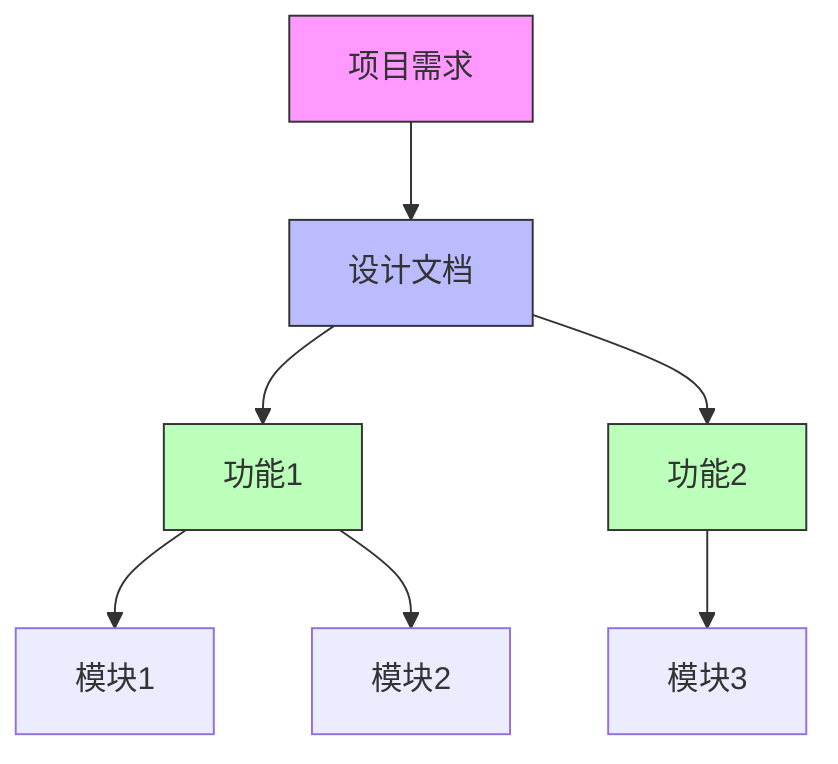
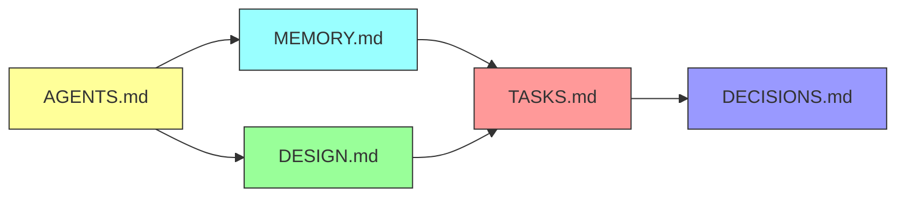
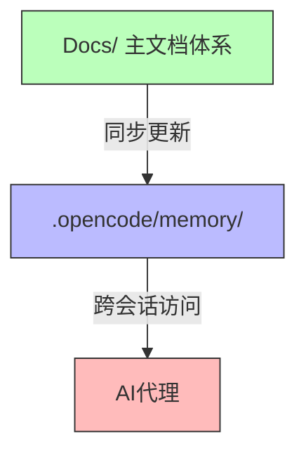

# 知识图谱 (INDEX.md)

> 项目文档导航与知识关系索引

---

## 文档导航

### 目录结构

```
项目根目录
├── AGENTS.md ──────────── 开发规范
├── 项目需求.md ────────── 原始需求（可选）
│
├── Docs/               # 主文档体系
│   ├── MEMORY.md ──────── 项目记忆（三维记忆系统）
│   ├── TASKS.md ───────── 任务管理（合并简化版）
│   ├── DESIGN.md ──────── 设计文档（扩展结构）
│   ├── INDEX.md ───────── 知识图谱（本文件）
│   ├── DECISIONS.md ───── 决策日志
│   │
│   ├── features/ ──────── 功能级文档
│   │   └── {feature-name}/
│   │       ├── MEMORY.md
│   │       ├── TASKS.md
│   │       ├── DESIGN.md
│   │       └── INDEX.md
│   │
│   └── modules/ ───────── 模块级文档
│       └── {module-name}/
│           ├── MEMORY.md
│           ├── TASKS.md
│           ├── DESIGN.md
│           └── INDEX.md
│
└── .opencode/          # OpenCode配置（标准结构）
    ├── agents/          # 代理配置
    │   ├── README.md
    │   └── example-agent.md
    ├── commands/        # 命令配置
    │   ├── README.md
    │   └── example-command.md
    ├── plugins/         # 插件目录
    │   └── README.md
    ├── skills/          # 项目级Skills
    │   ├── project-memory-skill/
    │   ├── inquiry-card-skill/
    │   └── knowledge-index-skill/
    └── memory/          # OpenCode项目记忆（与Docs/双向同步）
        ├── MEMORY.md
        ├── TASKS.md
        ├── DESIGN.md
        ├── INDEX.md
        └── DECISIONS.md
```

---

## 知识关系图

### 整体关系



### 文档依赖关系



### 文档同步关系



### 双重文档存储说明

项目采用双重文档存储体系：

#### Docs/ - 主文档体系
- 用于项目文档管理和维护
- 可手动编辑和更新
- 包含完整的项目文档结构

#### .opencode/memory/ - OpenCode项目记忆
- 供AI代理跨会话访问
- 与Docs/保持双向同步
- 自动在跨会话时加载

#### 同步规则
1. **同步时机**：Git提交前、文档更新后、跨会话衔接时
2. **同步方向**：Docs/ → .opencode/memory/（主文档→项目记忆）
3. **同步命令**：
   ```bash
   cp -r Docs/* .opencode/memory/
   ```

---

## 快速参考

### 核心文档

| 文档 | 用途 | 最后更新 |
|------|------|----------|
| [AGENTS.md](../AGENTS.md) | 开发规范与工作流程 | 2026-03-22 |
| [MEMORY.md](./MEMORY.md) | 三维记忆系统 | 2026-03-22 |
| [TASKS.md](./TASKS.md) | 任务管理与路线图 | 2026-03-22 |
| [DESIGN.md](./DESIGN.md) | 架构与设计文档 | 2026-03-22 |
| [DECISIONS.md](./DECISIONS.md) | 决策日志 | 2026-03-22 |

### OpenCode配置文档

| 文档 | 用途 | 最后更新 |
|------|------|----------|
| [.opencode/agents/README.md](../.opencode/agents/README.md) | 代理配置说明 | 2026-03-22 |
| [.opencode/commands/README.md](../.opencode/commands/README.md) | 命令配置说明 | 2026-03-22 |
| [.opencode/plugins/README.md](../.opencode/plugins/README.md) | 插件配置说明 | 2026-03-22 |
| [.opencode/skills/](../.opencode/skills/) | 项目级Skills | 2026-03-22 |
| [.opencode/skills/EVOLUTION.md](../.opencode/skills/EVOLUTION.md) | Skills进化记录 | 2026-03-22 |

### 项目代理（Agents）

#### 核心代理（5个）

| 代理 | 功能 | 调用方式 |
|------|------|----------|
| [code-reviewer](../.opencode/agents/code-reviewer.md) | 代码审查 | @code-reviewer |
| [test-runner](../.opencode/agents/test-runner.md) | 测试执行 | @test-runner |
| [doc-writer](../.opencode/agents/doc-writer.md) | 文档编写 | @doc-writer |
| [security-auditor](../.opencode/agents/security-auditor.md) | 安全审计 | @security-auditor |
| [performance-analyzer](../.opencode/agents/performance-analyzer.md) | 性能分析 | @performance-analyzer |

#### 扩展代理（4个）

| 代理 | 功能 | 调用方式 |
|------|------|----------|
| [debugger](../.opencode/agents/debugger.md) | 调试 | @debugger |
| [refactor](../.opencode/agents/refactor.md) | 重构 | @refactor |
| [dependency-manager](../.opencode/agents/dependency-manager.md) | 依赖管理 | @dependency-manager |
| [cicd-manager](../.opencode/agents/cicd-manager.md) | CI/CD管理 | @cicd-manager |

### 功能文档

| 功能 | 文档位置 | 状态 |
|------|----------|------|
| 待定义 | - | - |

### 模块文档

| 模块 | 文档位置 | 状态 |
|------|----------|------|
| 待定义 | - | - |

---

## 关键概念

### 三维记忆系统

基于《Memory in the Age of AI Agents》论文设计：

| 概念 | 定义 | 用途 |
|------|------|------|
| **Factual Memory** | 事实记忆 | 记录项目静态事实（元信息、决策、规则、约束） |
| **Experiential Memory** | 经验记忆 | 记录项目动态经验（历史、总结、反馈、迭代） |
| **Working Memory** | 工作记忆 | 记录当前活跃状态（任务、上下文、待决策项） |

### 7层询问模型

需求澄清的分层递进模型：

| 层级 | 名称 | 核心问题 |
|------|------|----------|
| L1 | 业务本质 | 为什么做？核心痛点？ |
| L2 | 用户画像 | 谁使用？使用场景？ |
| L3 | 核心流程 | 完整流程？异常处理？ |
| L4 | 功能清单 | 做什么？功能边界？ |
| L5 | 数据模型 | 数据结构？关系？ |
| L6 | 技术栈 | 框架？数据库？部署？ |
| L7 | 交付标准 | 验收标准？时间节点？ |

### Skills优先级

技能搜索的5个来源优先级：

| 优先级 | 来源 | 说明 |
|--------|------|------|
| 1 | GitHub - anbeime/skill | 通用技能补充库 |
| 2 | Awesome Claude Skills | 通用开发技能 |
| 3 | Anthropic官方Skills | 通用核心技能 |
| 4 | SkillHub | 中文场景/企业级技能 |
| 5 | UI UX Pro Max | UI/UX专项技能 |

---

## 主题索引

### 按主题分类

#### 架构相关
- [设计文档 - 架构设计](./DESIGN.md#2-架构设计)
- [设计文档 - 技术选型](./DESIGN.md#5-技术选型)

#### 任务相关
- [任务管理 - 当前迭代](./TASKS.md#当前迭代)
- [任务管理 - 待办任务](./TASKS.md#待办任务)
- [任务管理 - 里程碑](./TASKS.md#里程碑)

#### 记忆相关
- [项目记忆 - 事实记忆](./MEMORY.md#一factual-memory事实记忆)
- [项目记忆 - 经验记忆](./MEMORY.md#二experiential-memory经验记忆)
- [项目记忆 - 工作记忆](./MEMORY.md#三working-memory工作记忆)

#### 决策相关
- [决策日志](./DECISIONS.md)
- [项目记忆 - 技术决策](./MEMORY.md#12-技术决策)

#### OpenCode相关
- [代理配置说明](../.opencode/agents/README.md)
- [命令配置说明](../.opencode/commands/README.md)
- [插件配置说明](../.opencode/plugins/README.md)
- [项目记忆系统 Skill](../.opencode/skills/project-memory-skill/SKILL.md)
- [互动询问卡 Skill](../.opencode/skills/inquiry-card-skill/SKILL.md)
- [知识图谱 Skill](../.opencode/skills/knowledge-index-skill/SKILL.md)

#### 文档同步相关
- [开发规范 - 文档同步机制](../AGENTS.md#文档同步机制)
- [开发规范 - .opencode/目录结构](../AGENTS.md#目录结构)

---

## 更新记录

| 更新时间 | 更新内容 | 更新人 |
|----------|----------|--------|
| 2026-03-22 | 创建INDEX.md模板 | AI |
| 2026-03-22 | 添加完整.opencode/目录结构 | AI |
| 2026-03-22 | 添加Docs/与.opencode/memory/双向同步说明 | AI |
| 2026-03-22 | 添加OpenCode相关主题索引 | AI |

---

*最后更新: 2026-03-22*
