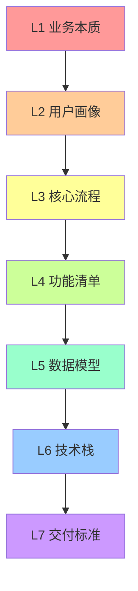
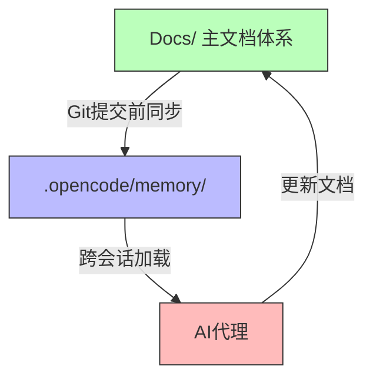

# QuickAgents - AI代理项目初始化系统

[](https://opensource.org/licenses/MIT)
[](https://opencode.ai)
[](https://github.com/Coder-Beam/Quick-Agents-for-Z.AI-GLM)
[](https://www.npmjs.com/package/quickagents-cli)

> 一套完整的AI代理项目初始化系统，提供开箱即用的项目初始化、需求澄清、多代理协作和跨会话恢复能力

---

## 📖 目录

- [简介](#简介)
- [核心特性](#核心特性)
- [快速开始](#快速开始)
- [项目结构](#项目结构)
- [核心功能](#核心功能)
- [使用指南](#使用指南)
- [最佳实践](#最佳实践)
- [常见问题](#常见问题)
- [贡献指南](#贡献指南)
- [许可证](#许可证)

---

## 简介

AGENTS.md 是一套为 AI 编码代理（如 OpenCode、Claude Code 等）设计的通用开发规范。它定义了一套完整的工作流程、文档体系和自动化机制，帮助 AI 代理更加专业、高效地完成软件开发任务。

### 设计理念

1. **零假设原则**：不脑补任何未确认的需求细节
2. **需求本质优先**：先问"为什么"，再谈"做什么"
3. **风险前置**：第一时间识别并处理风险
4. **可追溯性**：所有决策和变更都有记录

---

## 核心特性

### 🚀 启动流程规范

- **单一触发词**：输入「启动QuickAgent」即可启动完整初始化流程
- **智能需求收集**：7层扩展询问模型，启发式渐进询问
- **项目需求文件支持**：自动读取根目录「项目需求.md」

### 🧠 三维记忆系统

基于论文《Memory in the Age of AI Agents》设计：

| 记忆类型 | 用途 | 示例 |
|---------|------|------|
| **Factual Memory** | 事实记忆 | 项目元信息、技术决策、业务规则 |
| **Experiential Memory** | 经验记忆 | 操作历史、经验总结、用户反馈 |
| **Working Memory** | 工作记忆 | 当前状态、活跃上下文、待决策项 |

### 🤖 自动代理创建

- **智能创建**：编程项目自动创建9个标准开发代理
- **灵活调用**：支持 @提及调用 和 AI智能调度
- **完整配置**：自动生成完整的代理配置（description、mode、tools、permission）

### 📈 Skills自我进化

- **任务驱动**：任务完成后自动分析改进空间
- **定期优化**：每10任务或每周自动优化
- **全生命周期**：创建 → 更新 → 归档 → 删除
- **综合评估**：统计数据 + 用户反馈 + AI自评

### 📚 完整文档体系

- **混合结构**：项目级 + features/ + modules/
- **双向同步**：Docs/ ↔ .opencode/memory/
- **知识图谱**：INDEX.md 提供完整的文档导航

---

## 快速开始

### 1. 复制 AGENTS.md 到新项目

```bash
# 下载 AGENTS.md
curl -o AGENTS.md https://raw.githubusercontent.com/your-repo/AGENTS.md/main/AGENTS.md

# 或者直接复制文件到项目根目录
cp /path/to/AGENTS.md ./AGENTS.md
```

### 2. 启动初始化流程

在 OpenCode 或兼容的 AI 编码代理中，发送：

```
启动QuickAgent
```

> 💡 **兼容性说明**：同时支持「启动QuickAgents」和「启动AGENTS.MD」（旧版）

### 3. 回答询问卡

AI 会通过互动询问卡收集需求，按照 7 层扩展模型逐层澄清：

1. **L1 业务本质**：为什么做？核心痛点？
2. **L2 用户画像**：谁使用？使用场景？
3. **L3 核心流程**：完整流程？异常处理？
4. **L4 功能清单**：做什么？功能边界？
5. **L5 数据模型**：数据结构？关系？
6. **L6 技术栈**：框架？数据库？部署？
7. **L7 交付标准**：验收标准？时间节点？

### 4. 开始开发

需求澄清后，AI 会自动：
- 创建项目目录结构
- 初始化文档体系
- 创建标准开发代理（如果是编程项目）
- 开始执行第一个任务

---

## 项目结构

```
<PROJECT_NAME>/
├── AGENTS.md           # 开发规范（本文件）
├── 项目需求.md          # 原始需求（可选）
│
├── Docs/               # 主文档体系
│   ├── MEMORY.md       # 三维记忆系统
│   ├── TASKS.md        # 任务管理（合并简化版）
│   ├── DESIGN.md       # 设计文档（扩展结构）
│   ├── INDEX.md        # 知识图谱
│   ├── DECISIONS.md    # 决策日志
│   ├── features/       # 功能级文档
│   └── modules/        # 模块级文档
│
├── .opencode/          # OpenCode配置（标准结构）
│   ├── agents/         # 代理配置
│   │   ├── code-reviewer.md
│   │   ├── test-runner.md
│   │   ├── doc-writer.md
│   │   ├── security-auditor.md
│   │   ├── performance-analyzer.md
│   │   ├── debugger.md
│   │   ├── refactor.md
│   │   ├── dependency-manager.md
│   │   └── cicd-manager.md
│   ├── commands/       # 命令配置
│   ├── plugins/        # 插件目录
│   ├── skills/         # 项目级Skills
│   │   ├── project-memory-skill/
│   │   ├── inquiry-skill/
│   │   ├── project-memory-skill/
│   │   └── EVOLUTION.md
│   └── memory/         # OpenCode项目记忆
│       ├── MEMORY.md
│       ├── TASKS.md
│       ├── DESIGN.md
│       ├── INDEX.md
│       └── DECISIONS.md
│
├── src/                # 源代码
├── tests/              # 测试文件
└── ...
```

---

## 核心功能

### 1️⃣ 7层扩展询问模型

需求澄清的分层递进模型：



**退出条件**：
- 用户确认退出（「足够」「可以了」）
- 7层全部达标
- AI判断需求已充分明确

### 2️⃣ 三维记忆系统

#### Factual Memory（事实记忆）

记录项目静态事实：
- 项目元信息（名称、路径、技术栈）
- 技术决策（架构选型、API设计）
- 业务规则（计算规则、验证规则）
- 约束条件（技术、业务、时间、资源）

#### Experiential Memory（经验记忆）

记录项目动态经验：
- 操作历史（已完成任务、变更记录）
- 经验总结（踩坑记录、最佳实践）
- 用户反馈（意见、需求调整）
- 迭代记录（版本迭代、问题修复）

#### Working Memory（工作记忆）

记录当前活跃状态：
- 当前状态（任务、进度、阻塞点）
- 活跃上下文（相关文件、依赖关系）
- 临时变量（待处理事项、临时决策）
- 待决策项（需确认问题、待选方案）

### 3️⃣ 标准开发代理集

#### 核心代理（5个）

| 代理 | 功能 | 权限 |
|------|------|------|
| **code-reviewer** | 代码审查 | 只读 |
| **test-runner** | 测试执行 | bash, read |
| **doc-writer** | 文档编写 | write, edit |
| **security-auditor** | 安全审计 | 只读 |
| **performance-analyzer** | 性能分析 | bash, read |

#### 扩展代理（4个）

| 代理 | 功能 | 权限 |
|------|------|------|
| **debugger** | 调试 | bash, edit（需确认） |
| **refactor** | 重构 | edit, write（需确认） |
| **dependency-manager** | 依赖管理 | bash, write（需确认） |
| **cicd-manager** | CI/CD管理 | bash, edit（需确认） |

#### 调用方式

```bash
# @提及调用
@code-reviewer 审查 src/utils/auth.ts

# AI智能调度
AI自动识别场景并选择合适的代理
```

### 4️⃣ Skills自我进化

#### 进化触发

1. **任务完成后自动分析**
   - 分析Skills使用情况
   - 识别改进空间
   - 记录优化建议

2. **定期自动优化**
   - 每10个任务或每周
   - 综合使用统计数据
   - 执行优化更新

#### 全生命周期管理


#### 效果评估

| 维度 | 权重 | 指标 |
|------|------|------|
| 统计数据 | 40% | 使用次数、成功率、执行时间 |
| 用户反馈 | 40% | 满意度、改进建议、问题报告 |
| AI自评 | 20% | 执行效果、改进空间 |

### 5️⃣ 文档同步机制



**同步规则**：
- **时机**：Git提交前、文档更新后、跨会话衔接时
- **方向**：Docs/ → .opencode/memory/
- **命令**：`cp -r Docs/* .opencode/memory/`

### 6️⃣ Skill管理系统

QuickAgents 提供完整的 Skill 管理能力，支持向导式添加和智能整合。

#### 管理命令

| 命令 | 功能 | 示例 |
|------|------|------|
| `/add-skill` | 添加新skill | `/add-skill github:user/repo` |
| `/list-skills` | 列出已安装skills | `/list-skills` |
| `/update-skill` | 更新skill | `/update-skill skill-name` |
| `/remove-skill` | 删除skill | `/remove-skill skill-name` |
| `/skill-info` | 查看详情 | `/skill-info skill-name` |
| `/search-skills` | 搜索可用skills | `/search-skills ui design` |

#### 合并策略

| 策略 | 描述 | 适用场景 |
|------|------|----------|
| coexist | 并存 | 无冲突或互补功能 |
| merge | 合并 | 功能重叠但可整合 |
| replace | 替换 | 完全覆盖现有skill |
| skip | 跳过 | 冲突严重 |

#### Skill注册表

所有已安装的skills记录在 `.opencode/skills/registry.json`：

```json
{
  "core": [...],      // QuickAgents核心skills
  "extensions": [...], // 用户安装的扩展
  "recommended": [...], // 推荐skills
  "conflicts": [],    // 冲突记录
  "mergeHistory": []  // 合并历史
}
```

### 7️⃣ 推荐扩展Skills

#### UI/UX Pro Max ⭐推荐

为 Web/Mobile 项目提供专业 UI/UX 设计支持：

| 功能 | 数量 |
|------|------|
| UI样式 | 67种 |
| 颜色调色板 | 96种 |
| 字体配对 | 57种 |
| 推理规则 | 100条 |
| 技术栈支持 | 13种 |

**安装方式**：
```bash
npm install -g uipro-cli
uipro init --ai opencode
```

**使用示例**：
```
"帮我设计一个电商网站的落地页"
"创建一个深色模式的仪表板"
"为SaaS产品生成设计系统"
```

**适用项目**：Web应用、移动应用、落地页、SPA

---

## 使用指南

### 编程项目工作流

1. **启动**：输入「启动QuickAgent」
2. **需求收集**：回答7层询问卡
3. **自动初始化**：
   - 创建 Docs/ 目录结构
   - 创建9个标准开发代理
   - 创建3个配套Skills
4. **开发**：AI按照规范执行任务
5. **提交**：每次Git提交后生成跨会话衔接提示词

### 非编程项目工作流

1. **启动**：输入「启动QuickAgent」
2. **需求收集**：回答7层询问卡
3. **按需创建**：
   - 创建 Docs/ 目录结构
   - 根据需求创建必要的代理和Skills
4. **执行**：AI按照规范执行任务
5. **进化**：Skills根据使用情况自我优化

### 跨会话衔接

每次Git提交后，AI会自动生成跨会话衔接提示词：

```text
📍 跨会话衔接提示词

## 当前进度
- 已完成：[任务名称]
- 进度：[X%]
- 最新提交：[commit-hash] - [commit-message]

## 上下文摘要
- 项目：[项目名称]
- 技术栈：[核心技术栈]
- 当前阶段：[阶段]

## 下一步任务
- 任务ID：[T-XXX]
- 任务名称：[任务描述]

## 记忆文件路径
- 项目记忆：Docs/MEMORY.md
- 任务管理：Docs/TASKS.md

---
复制以上内容，在新会话中发送即可继续推进任务
```

---

## 最佳实践

### 1. 需求澄清

- ✅ 提供详细、量化的需求信息
- ✅ 明确功能边界和约束条件
- ✅ 准备「项目需求.md」文件加速流程
- ❌ 避免模糊表述（「大概」「差不多」）

### 2. 文档维护

- ✅ 每次Git提交前同步文档
- ✅ 及时更新MEMORY.md的工作记忆
- ✅ 重要决策记录到DECISIONS.md
- ❌ 不要跳过文档更新

### 3. 代理使用

- ✅ 信任AI智能调度
- ✅ 特殊需求时使用@提及调用
- ✅ 反馈代理使用效果帮助进化
- ❌ 不要频繁手动干预

### 4. Skills管理

- ✅ 让Skills自然进化
- ✅ 提供使用反馈
- ✅ 定期查看EVOLUTION.md
- ❌ 不要频繁创建重复Skills

---

## 常见问题

### Q1: 如何在其他项目中使用？

**A**: 复制 AGENTS.md 到新项目根目录，然后输入「启动QuickAgent」。

### Q2: 是否支持其他AI编码代理？

**A**: 是的，AGENTS.md 设计为通用规范，兼容 OpenCode、Claude Code 等主流AI编码代理。

### Q3: 如何自定义代理？

**A**: 在 `.opencode/agents/` 目录创建新的 `.md` 文件，按照配置规范填写即可。

### Q4: Skills如何进化？

**A**: Skills会在任务完成后自动分析改进空间，并定期优化。所有进化记录在 `.opencode/skills/EVOLUTION.md`。

### Q5: 如何处理需求变更？

**A**: 直接告知AI需求变更，AI会评估影响并更新任务清单和文档，经您确认后执行。

### Q6: Docs/和.opencode/memory/有什么区别？

**A**: Docs/是主文档体系用于人工管理，.opencode/memory/供AI跨会话访问。两者保持双向同步。

---

## 贡献指南

我们欢迎所有形式的贡献！

### 如何贡献

1. Fork 本仓库
2. 创建特性分支 (`git checkout -b feature/AmazingFeature`)
3. 提交更改 (`git commit -m 'Add some AmazingFeature'`)
4. 推送到分支 (`git push origin feature/AmazingFeature`)
5. 开启 Pull Request

### 贡献类型

- 🐛 Bug修复
- ✨ 新功能
- 📝 文档改进
- 🎨 代码优化
- 💡 建议和想法

### 代码规范

- 遵循 AGENTS.md 中定义的编码规范
- 添加适当的中文注释
- 更新相关文档

---

## 更新日志

### v2.0.1 (2026-03-22)

**新增**：
- ✨ 项目级Agents自动创建与调用规范
- ✨ 9个标准开发代理（5核心+4扩展）
- ✨ Skills自我持续进化规范
- ✨ EVOLUTION.md进化记录系统
- ✨ 完整的.opencode标准目录结构

**改进**：
- 📈 优化7层询问模型
- 📈 增强三维记忆系统
- 📈 完善文档同步机制

### v7.0 (2026-03-22)

**新增**：
- ✨ 「启动QuickAgent」触发机制
- ✨ 7层扩展询问模型
- ✨ 项目需求.md支持
- ✨ 三维记忆系统
- ✨ 合并简化文档结构
- ✨ 跨会话衔接提示词

---

## 许可证

本项目采用 MIT 许可证 - 查看 [LICENSE](LICENSE) 文件了解详情

---

## 致谢

感谢以下项目和资源的启发：

- [OpenCode](https://opencode.ai) - AI编码代理平台
- [Memory in the Age of AI Agents](https://arxiv.org/abs/2512.13564) - 记忆系统理论基础
- [Awesome Claude Skills](https://github.com/ryank immunity/awesome-claude-skills) - Skills设计参考

---

## 联系方式

- 项目主页: [GitHub Repository](https://github.com/your-repo/AGENTS.md)
- 问题反馈: [GitHub Issues](https://github.com/your-repo/AGENTS.md/issues)
- 讨论交流: [GitHub Discussions](https://github.com/your-repo/AGENTS.md/discussions)

---

<p align="center">
  Made with ❤️ by the Community
</p>

<p align="center">
  <a href="#top">回到顶部 ⬆️</a>
</p>
